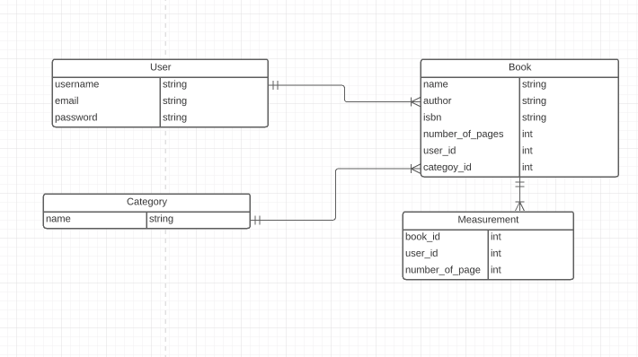
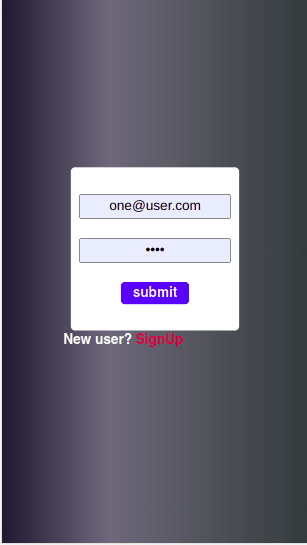
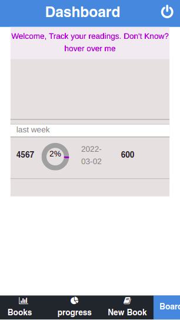
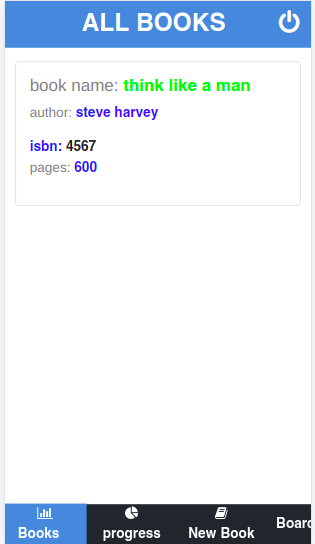
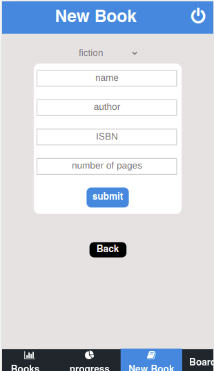
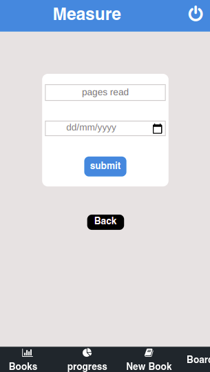

# ROR-Capstone: Grouping Transactions
This project  is based on a mobile version first app to track books(electronic pages precisely the name) and progress in the pages read
## Basic Features and Usage:
- 1. Sign up screen: A user can sign up with his name, email, password
- 2. Basic login screen: A user must log in to the app with his email and password
- 3. Books screen: These are all books added by the currently signed-in user
- 4. New book screen: This screen contains a form to add a book he will be tracking
- 5. Measure screen:  This screen contains a form to add the number of pages read for a       certain book
- 6. Progress screen: This screen contains the progress of all the books of the currently logged in user
  
# Screenshots

##   ERD(ENTITY RELATIONAL DIAGRAM)


# App Screenshots





# Presentations
##  Live Demo
[Live Demo Link](https://read-book-tracker-front-end.herokuapp.com/)

## Built With

- Ruby v2.7.2
- Ruby on Rails v6.1.1
- Rspec testing framework
- Javascript(Es6)
- React and Redux framework
- Jest testing framework

## Getting Started

### Prerequisites

Ruby: 2.7.2
Rails: 6.1.1
Postgres: >=9.5

To get a local copy up and running follow these simple example steps.
## Installation
- Clone the repository by typing this -> `git@github.com:che30/readbooktracker-front-end.git` in any folder of your choice
- Next type the command `cd readbooktracker-front-end` 
- Checkout  to the feature branch by  typing `git checkout feauture`
- Run the command `yarn install`

### Usage

Start server by typing on your terminal:

```
   - Run the command `npm start` 
```
wait for about 2 minutes if the app does not open on a new browser window then open the link`https://read-book-tracker-front-end.herokuapp.com` in your browser.

### Run tests
Type the command
```
    rspec --format documentation
```
in order to execute rspec tests

## Author
👤 **Che Nsoh Blanchard**

- GitHub: [@che30](https://github.com/che30)
- Twitter: [@BlanchardNsoh](https://twitter.com/che55085128 )
- LinkedIn: [Che Blanchard](https://www.linkedin.com/in/che-nsoh-9455271b0/)

## 🤝 Contributing

Contributions, issues, and feature requests are welcome!

Feel free to check the [issues page](issues/).

## Show your support

Give a ⭐️ if you like this project!

## Acknowledgments
My acknowledgment goes to the following without which this project would not have been a success
- Microverse for the general requirements.
- Design idea by Gregoire Vella on Behance.
- Flaticon.com and each individual designer for their icons used

## 📝 License

TBA